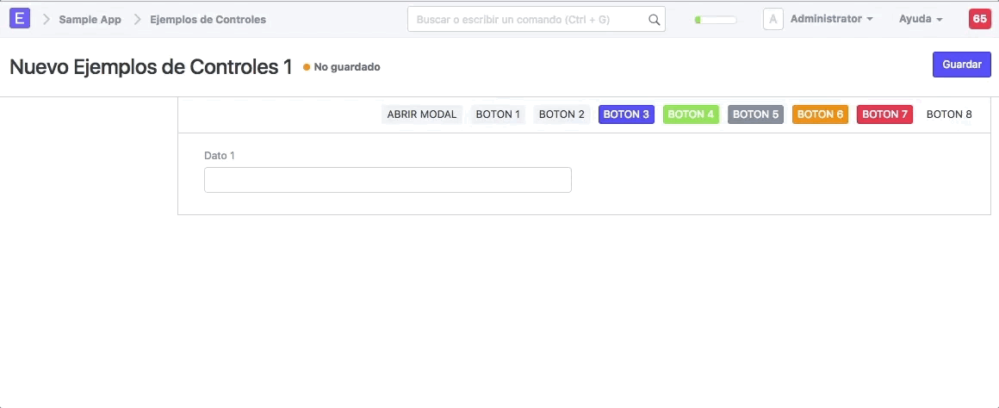
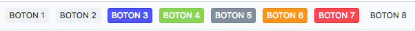
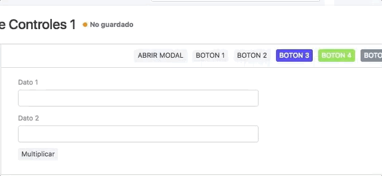

# Botones
Existen varios estilos,formas para crear botones:

## Dialogo
Codigo:
``` javascript
let mi_data = `
    <style>
    .mario {
        height: 200px;
            width: 50%;
        background-color: red;
        -webkit-animation-name: example; /* Safari 4.0 - 8.0 */
        -webkit-animation-duration: 4s; /* Safari 4.0 - 8.0 */
        animation-name: example;
        animation-duration: 4s;
    }

    /* Safari 4.0 - 8.0 */
    @-webkit-keyframes example {
        0%   {background-color: red;}
        25%  {background-color: yellow;}
        50%  {background-color: blue;}
        100% {background-color: green;}
    }

    /* Standard syntax */
    @keyframes example {
        0%   {background-color: red;}
        25%  {background-color: yellow;}
        50%  {background-color: blue;}
        100% {background-color: green;}
    }
    </style>

    <div class="mario"></div>`;

frm.add_custom_button(__('ABRIR MODAL'), function () {
    var dialog = new frappe.ui.Dialog({
        title: 'Prueba',
        fields: [{
            fieldtype: 'HTML',
            fieldname: 'cuadro_colores',
            label: __(''),
            reqd: false,
            description: __(""),
            options: mi_data
        }]
    });
    dialog.show();
});
```
Ejemplo:


## Botones Personalizados


### Codigo:

**Forma 1**
``` javascript
frm.add_custom_button(__("BOTON 1"), function () {
    window.open("https://www.google.com");
    // Tu codigo ...
});
```

**Forma 2**
``` javascript
frm.add_custom_button(__("BOTON 2"), function () {
    window.open("https://www.google.com");
    // Tu codigo ...
}).addClass("btn-default");
```

**Forma 3**
``` javascript
frm.add_custom_button(__("BOTON 3"), function () {
    window.open("https://www.google.com");
    // Tu codigo ...
}).addClass("btn-primary");
```

**Forma 4**
``` javascript
frm.add_custom_button(__("BOTON 4"), function () {
    window.open("https://www.google.com");
    // Tu codigo ...
}).addClass("btn-success");
```

**Forma 5**
``` javascript
frm.add_custom_button(__("BOTON 5"), function () {
    window.open("https://www.google.com");
    // Tu codigo ...
}).addClass("btn-info");
```

**Forma 6**
``` javascript
frm.add_custom_button(__("BOTON 6"), function () {
    window.open("https://www.google.com");
    // Tu codigo ...
}).addClass("btn-warning");
```

**Forma 7**
``` javascript
frm.add_custom_button(__("BOTON 7"), function () {
    window.open("https://www.google.com");
    // Tu codigo ...
}).addClass("btn-danger");
```

**Forma 8**
``` javascript
frm.add_custom_button(__("BOTON 8"), function () {
    window.open("https://www.google.com");
    // Tu codigo ...
}).addClass("btn-link");
```

## Utilizando el control boton de Doctype


### Codigo:

``` javascript
frappe.ui.form.on('Ejemplos de Controles', {
    refresh: function (frm) {
    },
    multiplicar: (frm) => {
        frappe.msgprint(`El Resultado de la Multiplicacion es : ${(frm.doc.dato_1 * frm.doc.dato_2)}`);
    }
});
```